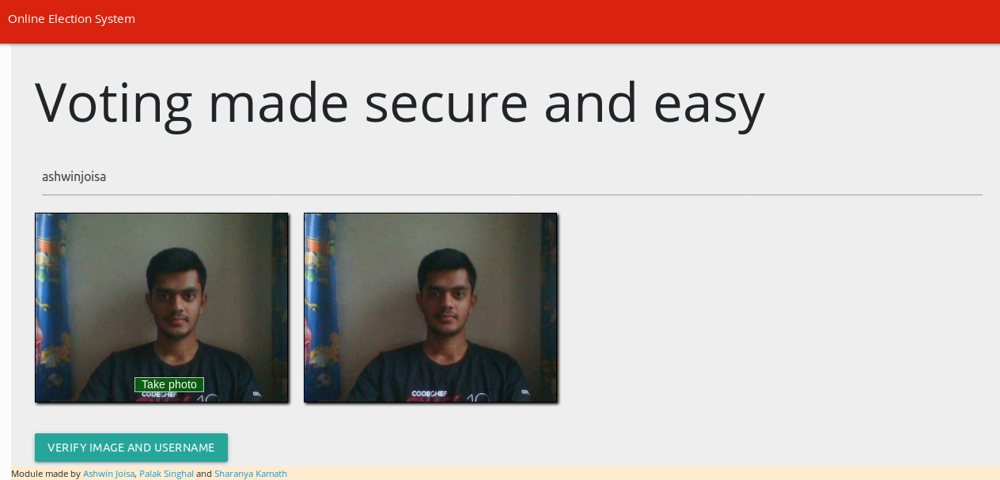
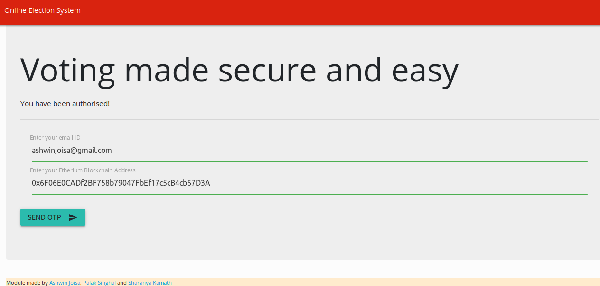
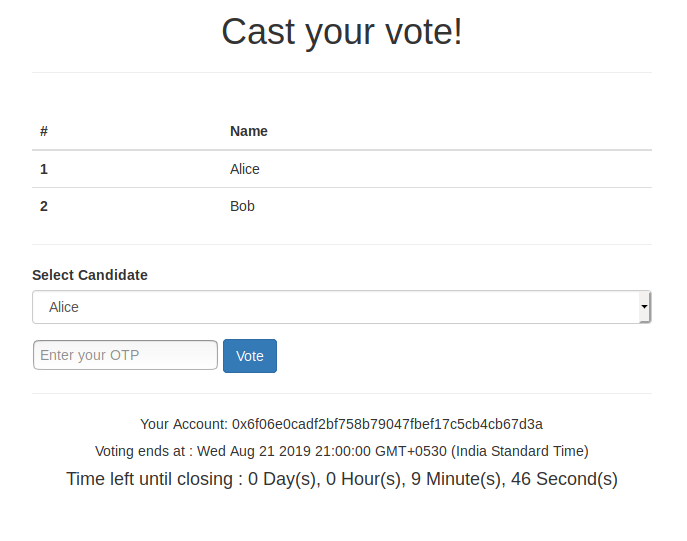
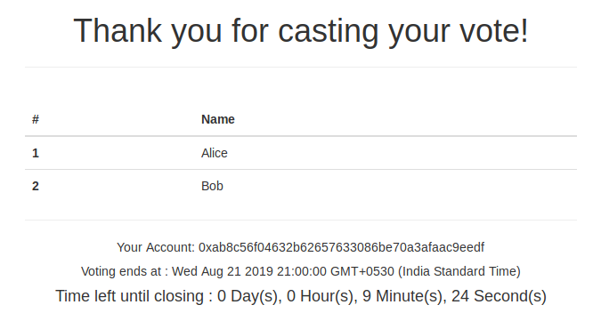
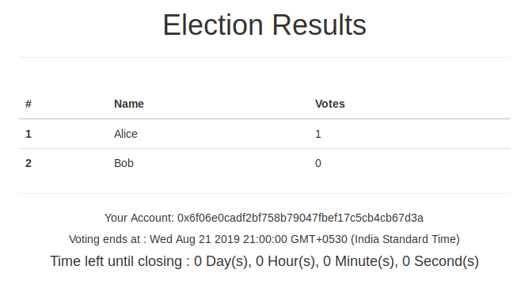

# Online Secure Voting System
> Built as part of Microsoft codefundo++ 2019 Hackathon. [Click here to view demo video](https://drive.google.com/file/d/1KKe_nvvw1qvfY4g9Rod4-2MP3uGlw84k/view?usp=sharing)

## Contributors
- [Ashwin Joisa](https://github.com/Aj163)
- [Sharanya Kamath](https://github.com/sharanyakamath)
- [Palak Singhal](https://github.com/smarty1palak)

## Overview
An online voting application using Azure Blockchain which gives the poll results immediately after the voting session, and is secure from any kind of manipulation of data. Since an online voting can be done remotely from anywhere in the world, authenticating and authorizing the user is of utmost importance. To do this we used 2-factor authentication, the first being facial recognition and the second being OTP verification.

## Features
- **Quick vote calculation**: No need to wait for many days for the results of the voting. This was implemented by incrementing the vote count as soon as a vote is submitted. Hence delay due to post-vote computation is eliminated. 
- **No manipulation of votes**: No person will be able to manipulate the votes. Also, unauthorized personnel will not be able to view, manipulate the votes, vote count or voter details. Azure Blockchain will be used to store all the data in secure blocks.
- **Face Recognition and OTP verification (2-Factor Authentication)**: We enabled an online voting system in which people can vote through the internet, from anywhere over the world. In order to prevent voter fraud, we use 2-factor authentication. In the first level of security, the face of the voter is captured by a web camera and sent to the backend. Later, the face of the person is verified with the face present in the database and validated. A password (OTP) is used as the second level of security. After entering the one time password generated to their mail, it is verified and the voter is allowed to vote.

## Business Value
- With online voting, only the people who do not have access to internet facilities or required hardware (like a computer or a mobile phone) can come to voting booths to vote.
- The voting booths can just be a normal computer connected to our application. Hence a lot of cost is saved in eliminating the need for EVMs.
- As no form of hacking can happen unlike in the case of EVMs, very minimal security is required at these booths, which again saves a huge cost spent on elections by the government. This also means that voting all over the country can be completed in a single day.
- The option of voting online will increase voter turnout by a drastic amount.

## Feasibility
- **Cost Effective**: There is no central administration which verifies the transaction hence the cost of maintaining a centralized interface is eliminated.
- **Ease Of Deployment**: With blockchain, once the infrastructure has been set up it can be used again and again with minimal modifications. Need of a central administrator is reduced, hence easier to deploy.
- **Secure And Fault Tolerant**: It is highly secure and fault tolerant because each node keeps a copy of the records and check each other in order to make a secure system. There is encryption involved at every stage which makes it highly reliable and secure.

## Screenshots of the application
- Facial Recognition

- Send OTP

- Before voting

- After voting

- Election results

